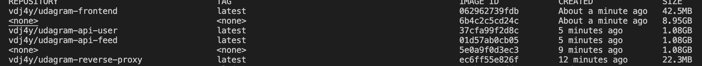
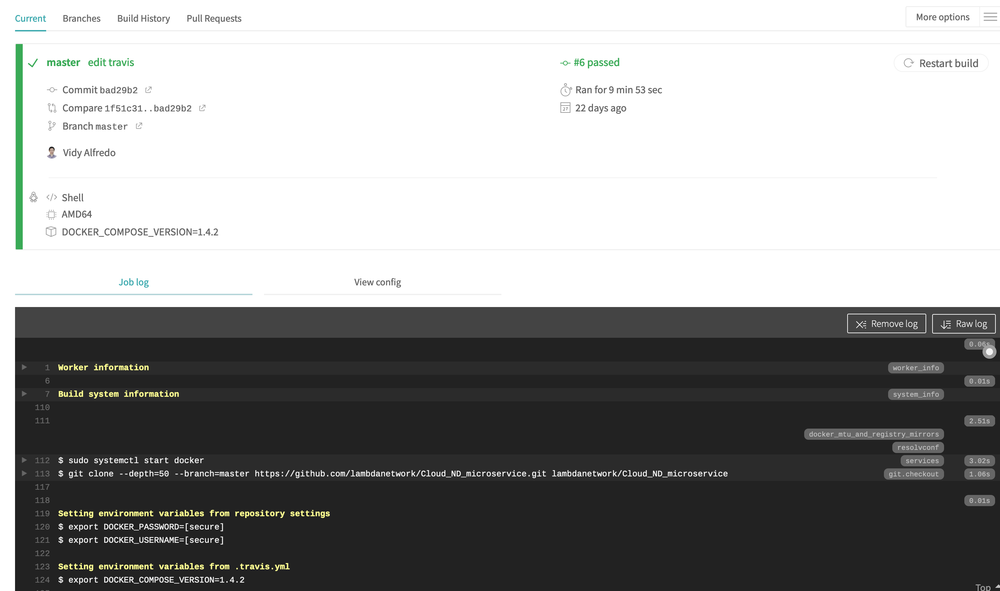
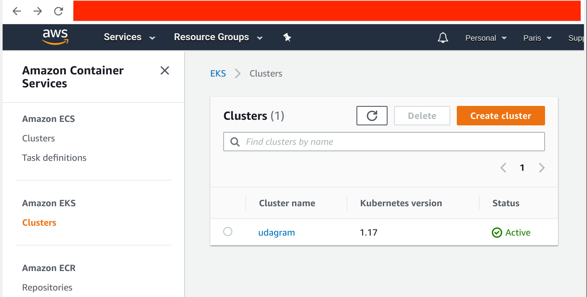
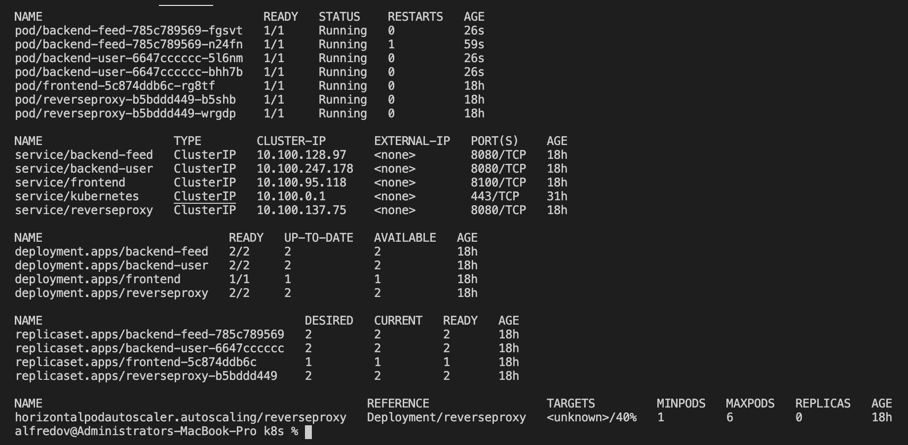
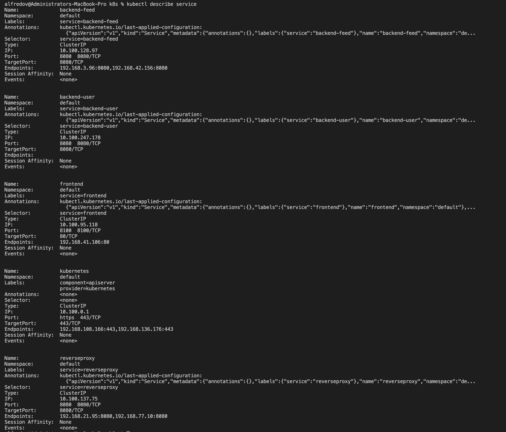
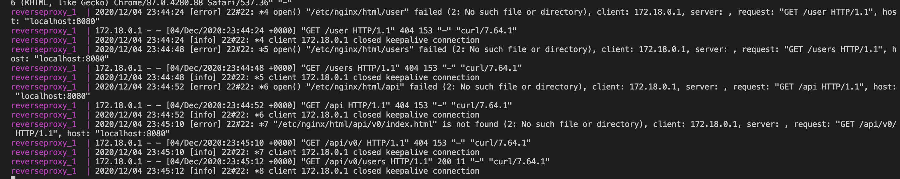

# Udagram Image Filtering Application

Udagram is a simple cloud application developed alongside the Udacity Cloud Engineering Nanodegree. It allows users to register and log into a web client, post photos to the feed, and process photos using an image filtering microservice.

The project is split into two parts:
1. Frontend - Angular web application built with Ionic Framework
2. Backend RESTful API - Node-Express application

# How to Run
### Docker images
1. `cd udagram-deployment/docker`
2. Build the images: `docker-compose -f docker-compose-build.yaml build --parallel`
3. Push the images: `docker-compose -f docker-compose-build.yaml push`
4. Run the containers: `docker-compose up`

### kubernetes
3. `cd udagram-deployment/k8s`
4. `kubectl apply -f .`

# Docker Hub

Screenshot of DockerHub shows the images.

# Travis 
1. setup travis ci/cd

# Service Orchestration with Kubernetes

* A screenshots of kubectl commands show the Frontend and API projects deployed in Kubernetes.   

* The output of kubectl get pods indicates that the pods are running successfully with the STATUS value Running.  
`kubectl get all`

* The output of kubectl describe services does not expose any sensitive strings such as database passwords.

# Debugging, Monitoring, and Logging

* Screenshot of one of the backend API pod logs indicates user activity that is logged when an API call is made.
`curl localhost:8080/api/v0/users`

